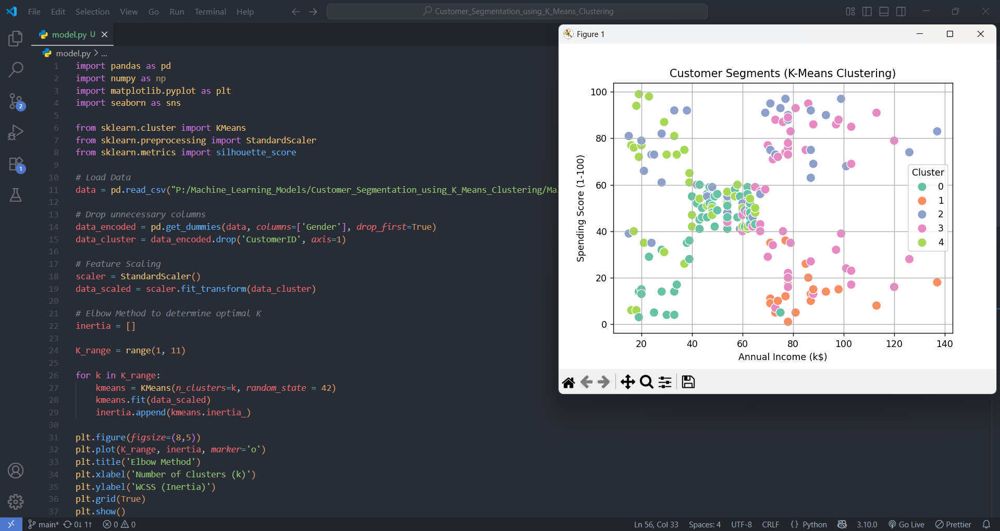
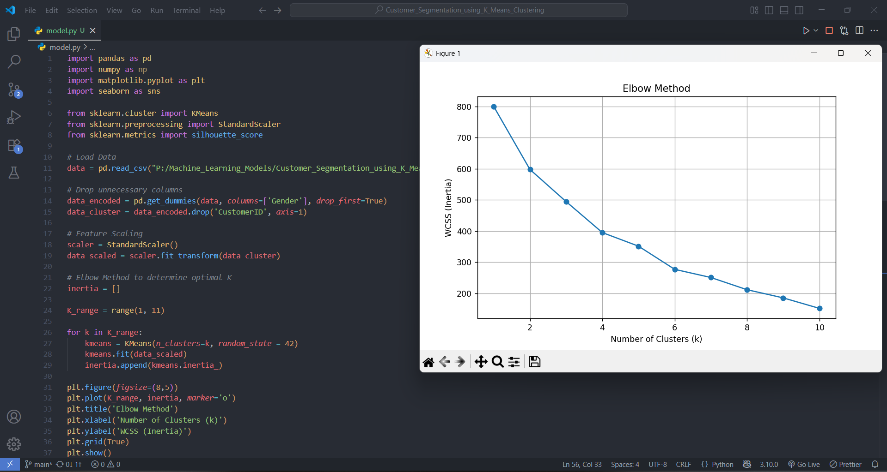

🛍️ Customer Segmentation using K-Means Clustering
This project is part of my ongoing AI/ML journey.
It is one of the unsupervised learning models I built after gaining foundational knowledge in clustering algorithms.

📌 Problem Statement
Goal: Group customers of a retail store into distinct clusters based on their purchasing behavior.

We use the K-Means Clustering algorithm to identify customer segments using a dataset with attributes like:

Annual Income

Spending Score

(Optional: Age, Gender, etc.)

🧠 What I Learned
Importing and preprocessing datasets using Pandas

Visualizing clusters with Matplotlib and Seaborn

Feature scaling with StandardScaler

Applying the K-Means algorithm and determining optimal k using the Elbow Method

Evaluating clusters with Silhouette Score

📊 Output Visualization
Each cluster is visually represented with different colors on a 2D plot. This helps retailers understand distinct customer groups and tailor marketing strategies accordingly.

🟢🟡🔵 Every cluster reveals a unique customer segment based on income and spending patterns.

](image.png)
](image-2.png)